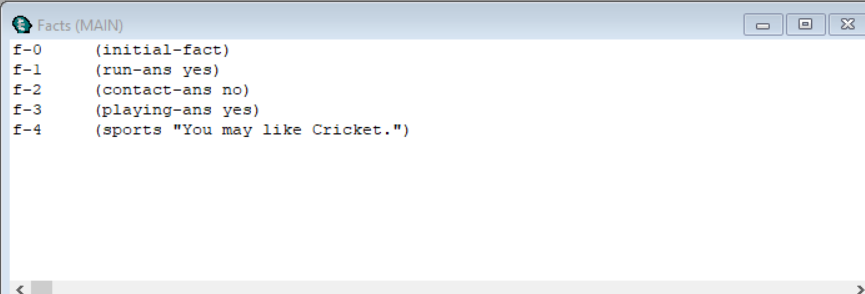

# Sports-Expert-system-using-AI
Building sports expert system using AI CLIPS language(invented by NASA) to recommend sports by answering questions. You can view the project demo on [YouTube](https://www.youtube.com/watch?v=u2ph9dFykVw). 

## Table of contents

* [General info](#general-info)
* [Screenshots](#screenshots)
* [Demo](#demo)
* [Methods and Tools](#methods-and-tools)
* [Code Examples](#code-examples)
* [Status](#status)
* [Contact](#contact)

## General info
A rule-based engine approach to recommend sports.

## Demo

**The entire demo of the project can be found on [YouTube](https://www.youtube.com/watch?v=u2ph9dFykVw).**

## Screenshots

## Methods and Tools
* Artificial Intelligence
* CLIPS
* Rule-based Engine

## Code Examples

******** RULES ********

(defrule running ""
   (not (run ?))
   (not (sports ?))                                                                                                                     
   => (assert (run-ans (answers "Do you like running? (yes/no)? "))))
   
(defrule contact ""
   (run-ans yes)
   (not (sports ?))                                                                                                                     
   =>
   (assert (contact-ans (answers "Do you prefer contact sports (yes/no)? "))))

(defrule alone ""
   (run-ans no)
   (not (sports ?))   
   =>
   (assert (alone-ans (answers "Do you like to play sport alone (yes/no)? "))))

## Status
Project is: _finished_.

## Contact
If you loved what you read here and feel like we can collaborate to produce some exciting stuff, or if you
just want to shoot a question, please feel free to connect with me on 
<a href="mailto:manishshukla.ms18@gmail.com">email</a> or 
<a href="https://www.linkedin.com/in/manishshukla-ms/" target="_blank">LinkedIn</a>
